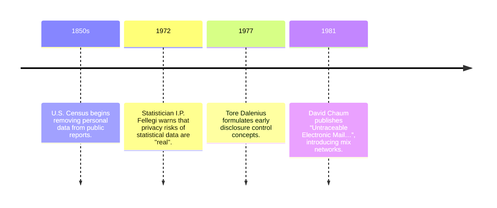
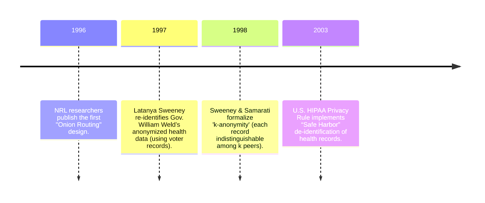
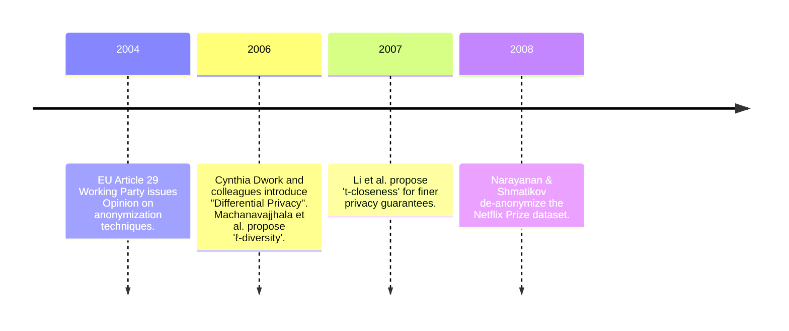
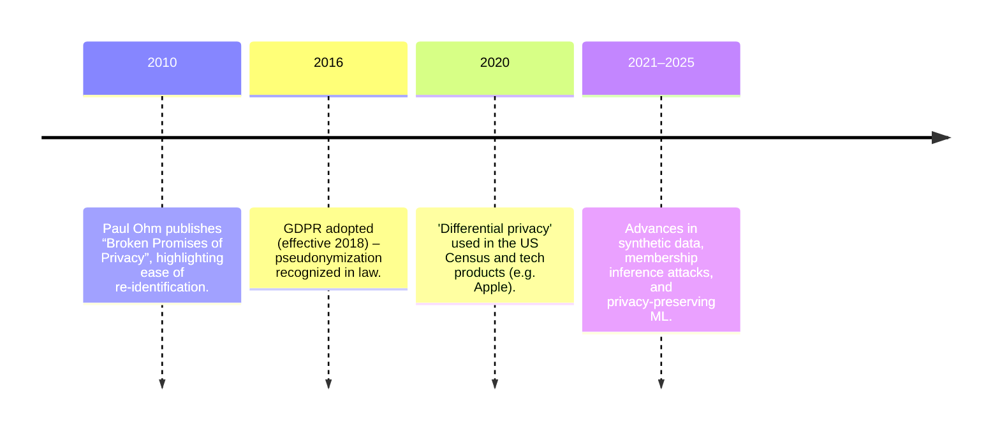
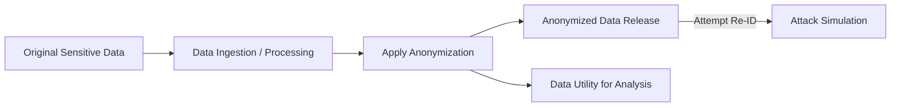
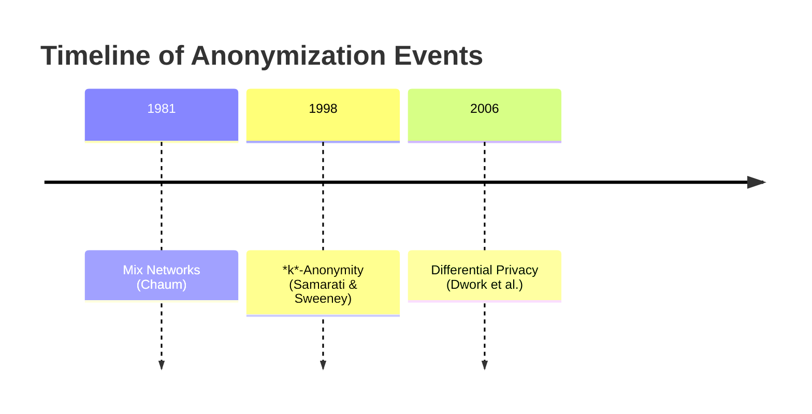
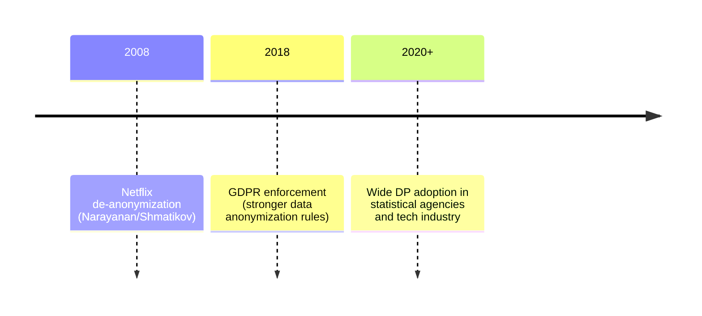

# History of Anonymization  
Data anonymization has evolved over two centuries, from early census privacy methods to modern mathematical guarantees.  
Key milestones include 19th‐century census de-identification practices, David Chaum’s mix networks (1981) for anonymous communication【20†L167-L173】, Latanya Sweeney’s re-identification of Governor Weld (1997) and the 1998 introduction of *k*-anonymity【44†L37-L44】, and Cynthia Dwork’s 2006 formulation of differential privacy【36†L139-L146】.  Landmark privacy laws (HIPAA in 2003, EU GDPR in 2018) and regulations codified these ideas.  Notable figures include Chaum, Sweeney, Dwork, and Narayanan/Shmatikov, whose Netflix study (2008) highlighted the vulnerability of naive de-identification【57†L14-L22】.  Technical advances include *k*-anonymity, *l*-diversity and *t*-closeness (mid-2000s), mix and onion routing (Chaum 1981; Syverson et al. 1996), and differential privacy (2006).  However, each method has trade-offs (see Table below): perfect anonymity is impossible without sacrificing utility【36†L112-L120】【57†L14-L22】.  Criticisms focus on re-identification risks and privacy/utility trade-offs【41†L39-L44】【30†L53-L61】.  The sociotechnical context includes rising data sharing, journalism/activism use of anonymity networks (Tor), and surveillance concerns.  Today, anonymization is crucial in data science (health, census, AI), but challenges remain in measuring privacy risk and ensuring compliance.  Unresolved questions include balancing data utility and privacy, anonymizing complex data types (e.g. streaming, graphs), and integrating legal standards with technical methods.

## Timeline of Anonymization  

Key historical themes: governments and statisticians sought to publish useful data without compromising individuals’ privacy. Early census methods (aggregation, noise, suppression【13†L106-L114】) gave way to formal statistical disclosure control (Fellegi 1972, Dalenius 1977). In parallel, cryptographers pursued anonymous communication (Chaum’s mix nets in 1981【20†L167-L173】). The Internet era saw *k*-anonymity (1998) and its extensions (ℓ-diversity, t-closeness) to mitigate linkage attacks, but attacks showed these could fail.  Differential privacy (2006) offered a rigorous privacy definition.  Laws like HIPAA and GDPR enshrined de-identification standards.

## Influential Figures and Contributions  
- **David L. Chaum (b.1955):** Introduced mix networks and digital pseudonyms to hide communication metadata【20†L167-L173】. His 1981 ACM paper is a cornerstone of network anonymity. (Later developed evolving protocols like cMix.)  
- **Latanya Sweeney:** MIT researcher who in 1997 re-identified anonymized medical data of Governor Weld【38†L13-L21】. Co-authored the 1998 paper defining *k*-anonymity【44†L37-L44】. Also introduced ℓ-diversity (2006) to address *k*-anonymity’s weaknesses. Served as lead on many privacy-policy studies and the US Data Privacy Lab.  
- **Pierangela Samarati:** Alongside Sweeney, formulated *k*-anonymity (1998)【44†L37-L44】. Worked on practical algorithms for anonymization (suppression and generalization).  
- **Cynthia Dwork:** Theoretician who in 2006 co-founded differential privacy【36†L139-L146】. Her definitions and algorithms underpin modern data privacy. She helped bridge theoretical computer science and data policy.  
- **Arvind Narayanan & Vitaly Shmatikov:** Computer scientists who demonstrated large-scale de-anonymization on real datasets (e.g. Netflix Prize 2008)【57†L14-L22】. Their work rigorously quantified privacy risks of publishing high-dimensional data.  
- **Paul Ohm:** Legal scholar who publicized the failures of anonymization, arguing privacy laws had a false sense of protection【41†L39-L44】. His 2010 law review article spurred policy reevaluation.

Other notable contributors include **Gastwirth** (privacy metrics), **Barth-Jones** (epidemiological privacy analysis【38†L13-L21】), and cryptographers (**Goldschlag**, **Reed**, **Syverson** – onion routing).

## Anonymization Techniques and Breakthroughs  
Researchers have developed many techniques to protect privacy. Major methods include:

- **Data Removal:** Stripping direct identifiers (names, SSNs). This basic step is necessary but not sufficient alone【4†L210-L218】.
- **Generalization:** Replacing values with broader categories (e.g. birthdate → year). Used in *k*-anonymity and data masking.
- **Suppression:** Removing rare or unique attribute values. *k*-anonymity uses suppression to ensure each quasi-identifier tuple repeats ≥*k* times【44†L37-L44】.
- **Randomization / Noise Addition:** Perturbing values with random noise. Early idea (Fellegi 1972) later formalized as **differential privacy** (DP)【36†L139-L146】, which adds calibrated randomness to guarantee mathematical privacy.  
- **ℓ-Diversity / t-Closeness:** Refinements of *k*-anonymity requiring diversity of sensitive attributes within each equivalence class or closeness to global distribution (circa 2006–2007).  
- **Data Swapping & Microaggregation:** Shuffling or grouping records so values are exchanged or summarized, maintaining overall distributions.  
- **Synthetic Data Generation:** Creating artificial data drawn from the same distribution (possibly with DP guarantees) so raw values never released. (Modern work uses ML models like GANs or Bayesian methods).  
- **Pseudonymization:** Replacing identifiers with consistent pseudonyms (tokens). This allows data linkability for analysis but retains re-identification risk if the key is discovered. GDPR defines it as a safeguard, not true anonymization【28†L18-L27】.  
- **Cryptographic Methods:** Homomorphic encryption and secure multiparty computation can, in some contexts, allow computation on private data without revealing raw values. These are more nascent in privacy tech.  
- **Network Anonymity:** For communication privacy, *mix networks* (Chaum 1981) and *onion routing* (1996) hide sender/receiver. Tor (launched 2003) is a low-latency onion router widely used by activists and journalists.

**Technique Comparison:** The table below summarizes key features of representative techniques.

| **Technique**       | **Strengths**                               | **Weaknesses**                                | **Use Cases**                  | **Assumptions/Notes**                                |
|---------------------|---------------------------------------------|-----------------------------------------------|--------------------------------|-------------------------------------------------------|
| **k-Anonymity**       | Simple; intuitive group anonymity          | Vulnerable to linkage with quasi-identifiers; fails if classes lack diversity【44†L37-L44】 | Tabular data release, HIPAA safe harbor | Assumes adversary only knows quasi-IDs; high-level quasi-ID selection critical. |
| **ℓ-Diversity**         | Protects against attribute disclosure (insider knowing distribution) | Still fails for skewed or similar sensitive values (homogeneity attacks). | Health records, survey data     | Assumes enough diversity in each group; computationally intensive.   |
| **t-Closeness**         | Binds distribution of sensitive attribute | May over-generalize, reducing data utility severely; complex to enforce. | Specialized statistical releases | Assumes known global distribution; difficult at high dimensionality. |
| **Differential Privacy** | Provable: limits any one record’s influence; composition guarantees | Adds noise → utility loss; requires careful privacy budget (ε); technical barriers for practitioners. | Large-scale data analytics, query interfaces (e.g. census) | Assumes formal model of queries; privacy “ε” parameter selection critical. |
| **Synthetic Data (DP/Synthetic)** | High utility if model captures data; no real data released | Leakage if model overfits; hard to ensure realism; testing privacy is nontrivial. | Machine learning datasets, data sharing for ML | Often uses DP for training; assumes generative model is accurate. |
| **Pseudonymization** | Allows tracking with unlinkability to real identity (w/o key) | Not truly anonymous: de-pseudonymization possible; considered personal data under GDPR【28†L18-L27】 | Longitudinal studies, regime requiring occasional re-link | Assumes secure key storage; legal obligations if key lost. |
| **Data Masking / Generalization** | Easy to implement (suppression, rounding, binning) | Heuristic; no formal guarantees; vulnerable to modern linkage attacks. | Data warehousing, middleware for testing | Assumes no skilled adversary; often considered “just an obfuscation”. |
| **Mix/Onion Routing** | Protects metadata (who talks to whom); widely deployed (Tor) | Vulnerable to timing/correlation attacks without cover traffic; needs many participants for strong anonymity. | Anonymous browsing, whistleblowing | Assumes some honest mix nodes; global adversary still a challenge (for mix nets)【20†L167-L173】. |

*Table: Comparison of anonymization techniques (strengths, weaknesses, typical uses)【44†L37-L44】【57†L14-L22】.*

## Legal, Regulatory and Policy Developments  
- **OECD Guidelines (1980) & Fair Information Practices:** Early principles for data handling (collection limitation, purpose, security). Though not explicit on anonymization, they set the stage for later laws.  
- **US Privacy Act (1974):** First U.S. federal law restricting personal data disclosure, requiring agencies to de-identify published records.  
- **HIPAA Privacy Rule (2003):** Introduced Safe Harbor de-identification standard: removal of 18 identifiers (names, SSNs, full dates, etc.)【26†L299-L304】. HIPAA also allows Expert Determination if risk is low (likely infeasible without testing). This was partly motivated by cases like Governor Weld’s re-ID【38†L13-L21】.  
- **EU Data Protection Directive (1995) & GDPR (2016/2018):** GDPR explicitly recognizes *pseudonymisation* as a safeguard, but defines truly anonymized data as outside the scope of the law【28†L18-L27】. Recital 26 of GDPR notes that data is anonymous if individuals are “no longer identifiable by any means likely reasonably to be used.” The 2014 WP29 Opinion codified this: anonymization requires irreversibly preventing identification【30†L53-L61】, whereas pseudonymization only reduces linkability【30†L87-L94】.  
- **National Laws:** Germany’s Federal Data Protection Act, UK’s Data Protection Act, and California’s CCPA/CPRA all address de-identification in some form (often as part of data breach rules or consumer privacy rights). California’s CPRA (2023) explicitly permits processing of de-identified data but requires reasonable effort to prevent re-identification.  
- **Landmark Incidents:** The infamous AOL search data release (2006) and Netflix Prize breach (2008) prompted regulators to scrutinize “anonymized” data releases【57†L14-L22】. Privacy lawsuits (e.g. *Dunbar v. Google* – Wi-Fi data collection, *In re Google Street View*) dealt with data collection, not anonymization per se, but raised public awareness.  
- **International Treaties:** Council of Europe Convention 108 (1981, updated 2018) addresses data protection globally.  
- **Regulatory Guidance:** Agencies (HHS, FTC) have issued guidance on de-identification methods. For example, HHS’s 2012 Guidance clarified HIPAA methods【26†L299-L304】. EU’s EDPB and Article 29 Group have released opinions on anonymization techniques, emphasizing context and risk analysis【30†L53-L61】.

Regulations generally treat anonymized data as non-personal only if re-identification risk is negligible. The law often mandates particular methods (e.g. *k*-anonymity as a safe harbor in some settings) or relies on privacy impact assessments.

## Recurring Problems, Criticisms, and Limitations  
Anonymization methods face inherent tensions:

- **Re-Identification Attacks:** Numerous studies (e.g. the Netflix Prize【57†L14-L22】, AOL search logs) have shown that “removing names and ZIP codes” is insufficient【4†L210-L218】. Modern adversaries can combine datasets (voter rolls, social media, etc.) to deanonymize records. As Paul Ohm noted, researchers can “often ‘reidentify’ or ‘deanonymize’ individuals…with astonishing ease”【41†L39-L44】.  
- **Privacy vs. Utility Trade-off:** Stronger anonymity usually means less useful data【13†L94-L102】. *k*-anonymity and its variants often generalize data so much that analysis suffers. Differential privacy’s noise addition affects accuracy of statistics. Achieving ε small enough often requires prohibitive noise. Apple’s own implementation of differential privacy (2016) later came under criticism for weak parameters, highlighting the practical challenge【59†L175-L184】.  
- **Assumptions about the Adversary:** Many models assume limited or noisy background knowledge. Real adversaries may use machine learning and big auxiliary databases. Dalenius’s early formal statement (1977) – that an adversary knowing all but one could infer that one – still haunts privacy researchers.  
- **Legal Ambiguity:** As the 2014 EU Opinion emphasizes, truly “anonymous” data must consider all means *likely reasonably* used for ID【30†L53-L61】. The bar is fuzzy: what counts as “unlikely”? Cross-border data flows complicate which standards apply.  
- **Misconceptions:** Many users and organizations overestimate anonymization. The WP29 warned against calling pseudonymization “anonymization”【30†L87-L94】. Outdated regulations (e.g. HIPAA’s Safe Harbor) specify fixed lists of identifiers; however, any unique combination of quasi-identifiers can undermine them.  
- **Adversarial and ML Attacks:** Advances in machine learning enable new privacy attacks (e.g. membership inference, model inversion). Even differentially private mechanisms can leak information if not properly tuned (composition across queries, hyperparameter data). These raise open research questions.

In summary, **no method guarantees both perfect privacy and full utility**. The literature repeatedly finds that “anonymization [alone] fails”【41†L39-L44】 when misapplied.

## Sociotechnical Context and Motivations  
Privacy concerns have been driven by both social and technical factors:

- **Surveillance and Civil Liberties:** Outcries against government data collection (from FBI's Carnivore to NSA leaks) have fueled demand for anonymity. Technologies like Tor (derived from Onion Routing) are used by journalists, activists (e.g. during Arab Spring), and dissidents to protect sources and speech.  
- **Big Data and Commerce:** Firms and governments collect vast personal data for analytics. Yet public awareness of data misuse (e.g. Cambridge Analytica 2018) pushes for stronger anonymization in shared datasets. Healthcare research demands sharing sensitive records, spurring methods to enable research without compromising patient privacy.  
- **Whistleblower and Press Freedoms:** The long journalistic tradition of source confidentiality (Deep Throat in Watergate) extends to digital context. SecureDrop and Tor hidden services allow anonymity. Legal doctrines (First Amendment) parallel data anonymity norms (right to anonymous speech).  
- **Regulatory Pressures:** New privacy laws (GDPR, CCPA) require data minimization. Compliance encourages anonymizing data whenever possible to avoid strict consent requirements. Pseudonymous identifiers (e.g. user IDs) are often used to track behavior while avoiding “personal data” classification, though GDPR still treats pseudonymous data as personal.  
- **Ethical AI:** As AI systems train on personal data, concerns arise about models memorizing identities. Differential privacy and federated learning emerged partly to address these new contexts.

Thus, anonymization research is inherently interdisciplinary, involving law, ethics, statistics, computer science, and domain experts. The motivation is not only avoiding legal penalties but building public trust in data practices.

## Modern Applications and Current Challenges  
Today anonymization techniques are applied widely:

- **Statistical Releases:** National statistics offices (e.g. US Census 2020 used differential privacy to publish summaries), health studies (medical trial data), transport (traffic origin-destination data), and marketing analytics all rely on de-identified datasets.  
- **Data Sharing Platforms:** Companies and data brokers produce “anonymized” consumer datasets. Cloud services offer DP-enabled analytics tools (Google’s and Microsoft’s DP frameworks).  
- **Machine Learning:** Privacy-preserving ML (federated learning + DP) aims to train models on decentralized personal data (mobile keyboards, health sensors) without central collection of raw data. Synthetic data generation is touted for training AI when real data is too sensitive.  
- **Anonymity Networks:** Tor remains the largest privacy network; mixnets are seeing renewed interest (e.g. blockchain coin mixers). Messaging apps (Signal, Session) use mixnet concepts to anonymize source.  
- **IoT and Mobile:** Geolocation and sensor data anonymization is an active area; researchers study how movement patterns can re-identify users.  
- **Blockchain and Crypto:** Concepts of anonymity vs pseudonymity apply to cryptocurrencies (privacy coins, mixers) – drawing on Chaum-style techniques.

**Current Challenges:** Achieving the right level of privacy for emerging data types (graph data, text, images) is hard. Differential privacy in deep learning is immature and often yields poor model accuracy. Ensuring transparency (explaining anonymization to users and regulators) is difficult. The cost of wrong anonymization (privacy breaches) can erode trust. Moreover, the rapid pace of data analytics (AI) continuously tests old privacy methods, requiring ongoing research. 

**Open Research Questions:** What formal guarantees best capture real-world privacy harms? How to quantify re-identification risk in complex, high-dimensional data? Can synthetic data reliably replace sensitive datasets? What are ethical standards for anonymization when social norms shift? And how will advances in computing (quantum, ML) change the landscape of breaking privacy protections? 

In conclusion, anonymization remains a dynamic field balancing data utility with privacy protection. Its history shows successive innovations met by new attacks【41†L39-L44】【57†L14-L22】. A “101” survey must recognize that no one-size-fits-all solution exists: each use case requires careful choice of techniques, informed by both technical limits and legal/policy context.

## Charts and Tables  

*Figure: Simplified data anonymization process. Identifiers are removed and data is transformed (via noise, suppression, etc.) to produce a released dataset, which is then used by analysts — but remains susceptible to adversarial re-identification attempts.*

*Figure: Key milestones in anonymization history (see text for details and sources).*

## References  
- Chaum, D. *Untraceable Electronic Mail, Return Addresses, and Digital Pseudonyms* (Commun. ACM, 1981)【20†L167-L173】.  
- Samarati, P. & Sweeney, L. (1998). *k-Anonymity and Its Enforcement Through Generalization and Suppression*【44†L37-L44】.  
- Narayanan, A. & Shmatikov, V. (2008). *Robust De-anonymization of Large Sparse Datasets*【57†L14-L22】.  
- Dwork, C. (2006). *Differential Privacy*【36†L139-L146】.  
- Ohm, P. (2009). *Broken Promises of Privacy: Responding to the Surprising Failure of Anonymization*【41†L39-L44】.  
- Article 29 Data Protection Working Party (2014). *Opinion 05/2014 on Anonymisation Techniques*【30†L53-L61】【30†L87-L94】.  
- EDPB (2025). *Guidelines on Pseudonymisation*【28†L18-L27】.  
- Barth-Jones, D. (2012). *“Re-identification” of Governor Weld’s Medical Information*【38†L13-L21】 (SSRN).  
- Kargupta, H. et al. (2003). *On the Privacy-Preserving Properties of Random Data Perturbation*. Proc. IEEE.  
- Bellovin, S.M. (2019). *Privacy and Synthetic Datasets* (Stanford Law).  
- Oberski, D.L. & Kreuter, F. (2020). *Differential Privacy and Social Science: An Urgent Puzzle*【36†L112-L119】【36†L139-L146】. Harvard Data Science Review.  
- Wired (2017). *How One of Apple’s Key Privacy Safeguards Falls Short*【59†L175-L184】.  
- Additional industry and legal sources: HHS HIPAA Guidance【26†L299-L304】, Tor Project historical archives【54†L197-L205】, etc.  

