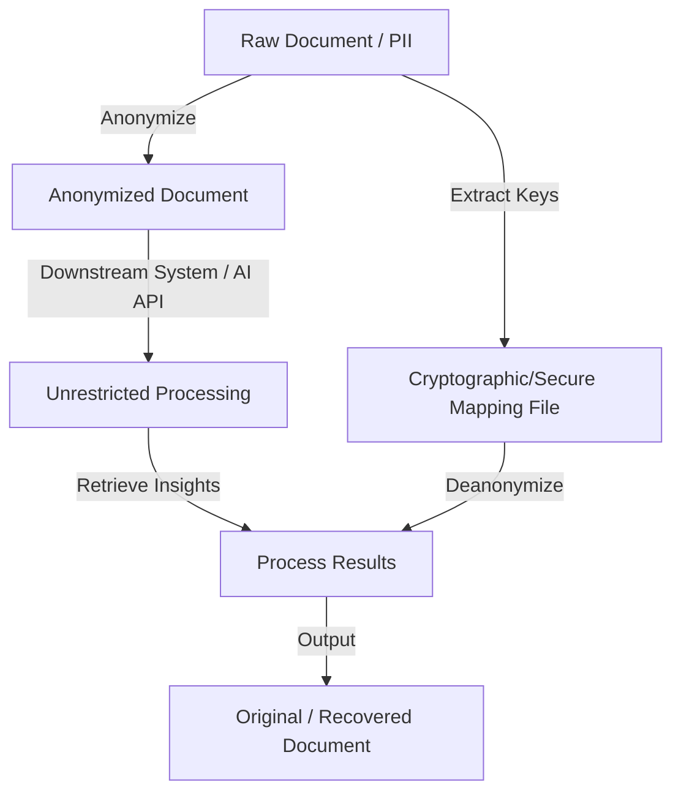

# Why Anonymize?

In the modern digital economy, data is one of the most valuable resources. However, much of this data is deeply personal. As organisations collect, process, and analyze more information, they face a critical question: **How can we extract value from data without violating individual privacy?**

This is where data anonymization and reversible deanonymization become essential.

---

## What is Anonymization?

**Data Anonymization** is the process of destroying or modifying personal identifiers in a dataset so that the individuals whom the data describes can no longer be identified, directly or indirectly. 

Under legal regimes like the European Union's General Data Protection Regulation (GDPR), if a dataset is truly anonymous, it is no longer considered "personal data" and is exempt from strict privacy regulations. This makes anonymization the ultimate goal for safe data sharing and retention.



### Reversible vs. Irreversible Anonymization
*   **Irreversible Anonymization (Redaction)**: The original values are permanently destroyed. It is highly secure, but it limits downstream utility when you need to follow up or link records back to the source.
*   **Reversible Anonymization (Masking & Mapping)**: Original PII is replaced with placeholders (e.g., `[PERSON_1]`, `[DATE_2]`), and a secure, encrypted mapping table is stored separately. The masked data can be sent to external entities (like AI models or third-party analysts), and the results can be mapped back to the individuals internally. This is the paradigm used by **PDF Anonymizer**.

---

## The Legal Compliance Landscape

Globally, privacy regulation has shifted from a best practice to a strict legal requirement. Failure to comply can result in catastrophic fines and reputational ruin.

| Regulation | Scope | Key Focus | Consequences of Violations |
| :--- | :--- | :--- | :--- |
| **[GDPR](https://gdpr-info.eu/)** (EU) | General data of EU citizens | Consent, right to be forgotten, strict definition of pseudonymization vs. anonymization. | Fines up to €20M or 4% of global annual turnover, whichever is higher. |
| **[HIPAA](https://www.hhs.gov/hipaa/for-professionals/privacy/special-topics/de-identification/index.html)** (US) | Protected Health Information (PHI) | Under the HIPAA Safe Harbor method, 18 specific identifiers (names, dates, geographic data) must be removed. | Severe civil and criminal penalties, including prison terms for intentional disclosure. |
| **[CCPA / CPRA](https://oag.ca.gov/privacy/ccpa)** (US) | California consumer data | Opt-out rights, deletion rights, strict rules on "selling" or "sharing" consumer data. | Civil penalties up to $7,500 per intentional violation; private right of action for data breaches. |

---

## The Risks of Deanonymization

One of the most dangerous misconceptions in data sharing is that simple redaction is enough. History is full of **deanonymization attacks** (also known as *re-identification attacks*), where attackers combined "anonymized" datasets with external public databases to identify individuals.

### Famous Deanonymization Failures

!!! warning "Case Study 1: The Netflix Prize Dataset (2007)"
    Netflix released an anonymized dataset of 100 million movie ratings from 500,000 users to help researchers build better recommendation algorithms. Researchers Arvind Narayanan and Vitaly Shmatikov proved they could identify individual Netflix users by correlating their ratings with public reviews on the Internet Movie Database (IMDb).
    
    *   **Source Research**: Narayanan, A., & Shmatikov, V. (2008). *[Robust De-anonymization of Large Sparse Datasets](https://arxiv.org/abs/cs/0610105)*. IEEE Symposium on Security and Privacy.

!!! warning "Case Study 2: Massachusetts GIC Medical Records (1997)"
    The Group Insurance Commission (GIC) in Massachusetts released "anonymized" health insurance records of state employees. Dr. Latanya Sweeney bought the voter registration list for the city of Cambridge (which contained birthdate, zip code, and gender) for $20. By combining the two databases, she successfully identified the medical records of the Governor of Massachusetts.
    
    *   **Source Research**: Sweeney, L. (2000). *[Simple Demographics Often Identify People Uniquely](https://dataprivacylab.org/projects/identifiability/paper1.pdf)*. Carnegie Mellon University, Data Privacy Lab.

### The Threat Vectors
- **Linkage Attacks**: Combining a masked dataset with another public dataset (e.g. voter registries, social media profiles).
- **Background Knowledge Attacks**: An attacker knows some details about a specific target in the dataset and uses context clues to isolate them.
- **Outlier Profiling**: Extreme or unique values (e.g., a patient who is 105 years old) make individuals easy to spot, even if their names are removed.

---

## Why Traditional Redaction is No Longer Sufficient
In unstructured text (like clinical notes, legal contracts, or corporate emails), PII is rarely just a name or a credit card number. It is woven into the context:
*   *"The CFO, who recently took over after John's departure in April, met with the representative from the Berlin office."*
*   Even if "John" is removed, the combination of *"CFO who started in April"* and *"Berlin office"* may narrow down the identity to one person.

To tackle this, we need **context-aware anonymization** that understands sentences, relationships, and concepts rather than just matching regex patterns.

---

## Where Anonymization Is Needed

Data privacy is not a niche requirement. It is a critical operational bottleneck in nearly every sector that deals with human activity. Let's look at the primary industries where data anonymization is essential.

### Healthcare & Life Sciences

Healthcare data contains some of the most sensitive information possible: medical histories, genetic sequences, psychiatric notes, and biometric measurements.

```
       [Raw Medical Record]
                |
     +----------+----------+
     |                     |
[Direct PII]          [Indirect PII]
(Name, SSN, MRN)      (Rare condition, Zip code, Doctor's note details)
     |                     |
     +----------+----------+
                |
      [Context-Aware Anonymizer]
                |
[Safe Health Record for Research]
```

#### Critical Use Cases
*   **Clinical Trials**: To develop new drugs and treatments, pharmaceutical companies must share patient trial data with academic partners, regulatory agencies (FDA/EMA), and independent biostatisticians. Patient identity must be fully protected while keeping the clinical outcomes intact.
*   **Medical Research & Machine Learning**: Building AI diagnostic assistants (e.g. models that detect tumors in medical imaging or notes) requires training datasets comprising millions of patient records. This training cannot use raw patient data without violating regulations like HIPAA and GDPR.
*   **Electronic Health Record (EHR) Sharing**: Sharing health trends (like tracking epidemics or flu seasons) with public health bodies requires stripping identifying information.

### Finance & FinTech

Financial datasets contain credit card numbers, bank routing information, investment balances, and physical address transaction details.

#### Critical Use Cases
*   **Fraud Detection Research**: To build models that detect credit card fraud, FinTechs must analyze actual transaction histories. These histories contain precise purchase times, merchant names, and customer details that could expose buying habits.
*   **Risk Modeling & Credit Scoring**: Banks share loan applicant data with third-party risk analysis companies. Anonymization ensures these audits occur without exposing individual applicants' identity.
*   **Regulatory Compliance & Auditing**: Financial institutions must verify that their systems comply with regulations like anti-money laundering (AML) without exposing customer accounts to external auditors.

### Academic & Corporate Research

Social scientists, economists, and UX researchers rely on human data to observe trends, run surveys, and validate hypotheses.

#### Critical Use Cases
*   **Open Science Initiatives**: Academic journals increasingly require researchers to share their raw datasets publicly to ensure reproducibility. Anonymization is required before uploading these datasets to open repositories (e.g. Zenodo or Harvard Dataverse).
*   **Product Analytics & Surveys**: Companies collect survey feedback containing free-text responses. Users often write their names, emails, or company details in these fields, requiring automated cleaning before internal sharing.

### Generative AI & Large Language Models (LLMs)

The rise of generative AI has introduced a new and massive privacy challenge. When training, fine-tuning, or running inference with LLMs, organizations must ensure they do not expose sensitive data.

!!! info "The AI Privacy Challenge"
    *   **Model Memorization**: LLMs are known to "memorize" parts of their training data. If PII is present in the training set, a user can prompt the model to leak phone numbers, addresses, or private emails of individuals.
    *   **Third-Party API Risks**: Sending documents (like customer service chats or legal briefs) to external API providers (e.g. OpenAI or Anthropic) can violate internal compliance policies if those documents contain raw customer data. Masking the PII before sending it to the API is a reliable way to utilize external LLMs safely.

### Sector Summary Table

| Sector | Direct PII to Protect | Indirect/Context PII to Protect | Regulatory Context |
| :--- | :--- | :--- | :--- |
| **Healthcare** | Patient Name, SSN, Phone, Medical Record Number. | Doctor's specific style, rare diseases, localized clinics, admission dates. | HIPAA, GDPR, local health acts. |
| **Finance** | Account Numbers, Credit Card, Owner Name. | Exact transactional timestamps, high-value transfer locations, merchant details. | PCI-DSS, GLBA, GDPR. |
| **Research** | Respondent Name, Email, IP Address. | Specific job roles, demographic outliers, unique combination of survey answers. | Institutional Review Board (IRB) guidelines. |
| **Enterprise / AI**| Customer Names, Staff logins, Client companies. | Internal codebase secrets, private project names, internal organizational charts. | SOC2, internal security policies. |

---

**In this course:**  
[Course Overview](index.md) | [Next: History](history.md)
