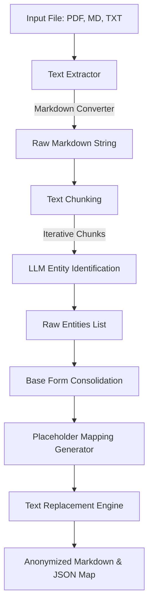

# Monorepo Architecture & Internal Design

This document details the architectural decisions, pipeline workflows, and core algorithms powering **PDF Anonymizer**.

---

## monorepo Architecture

PDF Anonymizer separates the underlying processing logic (SDK) from the command-line entry points. This decoupled design ensures the core library can be embedded into server APIs or automated data workflows without bringing along CLI dependencies.

```
                  +--------------------------------+
                  |     pdf-anonymizer-cli         |
                  |  (CLI interface using Typer)   |
                  +---------------+----------------+
                                  | (uses)
                                  v
                  +--------------------------------+
                  |     pdf-anonymizer-core        |
                  |  (Core SDK & LLM Adapters)    |
                  +---------------+----------------+
                                  |
         +------------------------+------------------------+
         |                        |                        |
         v                        v                        v
+----------------+       +----------------+       +----------------+
|  Text Loader   |       |   LLM Router   |       | Mapping Engine |
| & PDF Extractor|       | & API Adapters |       | & Reverser     |
+----------------+       +----------------+       +----------------+
```

---

## The Processing Pipeline

When you run `pdf-anonymizer run`, the system executes the following sequential steps:



### Text Extraction & PDF Conversion
*   Instead of traditional OCR or layout-unaware PDF parsing, the project uses `pymupdf4llm` to convert PDF files into clean, readable **Markdown**. This retains tables, headings, and lists in a structured text layout that LLMs can parse with higher accuracy.
*   For Markdown and Text files, standard file reads are executed.

### Semantic Chunking
*   Depending on the `--characters-to-anonymize` parameter (default `100,000` characters), the text is sliced into chunks:
    *   **Markdown/PDF**: Uses `langchain_text_splitters.MarkdownTextSplitter` to avoid cutting headers or code blocks midway.
    *   **Text/Fallback**: Uses `langchain_text_splitters.RecursiveCharacterTextSplitter`.
*   This keeps individual requests within LLM token constraints and limits memory footprints.

### LLM Entity Identification
*   Each chunk is sent to the selected LLM provider along with the chosen prompt.
*   The LLM returns structured JSON lists of detected entities, specifying their direct text and their base entity type (e.g. `PERSON`, `ORGANIZATION`, `DATE`, `LOCATION`).

### Base Form Consolidation
To solve coreference problems (e.g. associating "Dr. Smith", "Smith", and "Dr. John Smith" to the same individual):
*   The system extracts all entity `base_form` suggestions.
*   It sorts base forms by length (descending) and merges shorter matching forms into their longer canonical representation.

### Placeholder Mapping Generation
*   Standard placeholders are created using the entity type and an incremental count (e.g., `PERSON_1`, `PERSON_2`).
*   **Variations Handling**: If an entity is a partial or varied reference of a base form (e.g. "John" vs. "John Doe"), a sub-variant placeholder is generated (e.g., `PERSON_1.v_1`). This tracks how the text refers to the individual without losing syntactic differences.

### Replacing by Length Descending
*   When masking the text, entities are replaced in descending order of string length. This prevents partial replacement bugs (e.g. replacing "John" in "John Doe" before trying to replace "John Doe").

---

## Reversibility & The Mapping Engine

When executing `pdf-anonymizer deanonymize`, the recovery engine performs the following tasks:

### Bidirectional Mapping Compatibility
*   It accepts both current format (`placeholder -> original_value`) and legacy format (`original_value -> placeholder`) mapping tables by automatically detecting matching regex structures.

### Dynamic Wildcard Reversion
*   When replacing placeholders, it matches the base placeholder and any sub-variants dynamically using a regular expression:
    ```regex
    \bPLACEHOLDER_(?:\.v_\d+)?\b
    ```
    This ensures `PERSON_1.v_1` and `PERSON_1` are both restored to the same correct original name.

### Statistics & Auditing
After restoration, the engine computes:
*   `unused_mappings`: Placeholders present in the map that were not found in the anonymized text.
*   `not_found_mappings`: Placeholders detected in the text that had no matching entry in the map.
*   These are output to a JSON file in `data/stats/<stem>.deanonymization_stat.json` for validation and compliance auditing.

---

## See Also

- **[Recipes & Common Workflows](recipes.md)** — practical usage of the concepts described here (profiles, caching, debugging, round-trip workflows).
- **[CLI Reference](cli-usage.md)** — full command reference and profiles.
- **[SDK & API Usage](api-usage.md)** — programmatic access to the same engines.
- **[API Reference (auto)](api-reference.md)** — detailed function signatures.
- **[Installation & Setup](installation.md)** — environment and provider setup.
