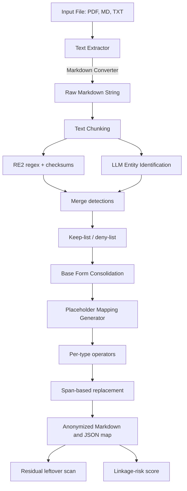

# Monorepo Architecture & Internal Design

This document details the architectural decisions, pipeline workflows, and core algorithms powering **PDF Anonymizer**.

---

## monorepo Architecture

PDF Anonymizer separates the underlying processing logic (SDK) from the command-line entry points. This decoupled design ensures the core library can be embedded into server APIs or automated data workflows without bringing along CLI dependencies.

```
                  +--------------------------------+
                  |     pdf-anonymizer-cli         |
                  |  (CLI interface using Typer)   |
                  +---------------+----------------+
                                  | (uses)
                                  v
                  +--------------------------------+
                  |     pdf-anonymizer-core        |
                  |  (Core SDK & LLM Adapters)    |
                  +---------------+----------------+
                                  |
         +------------------------+------------------------+
         |                        |                        |
         v                        v                        v
+----------------+       +----------------+       +----------------+
|  Text Loader   |       |   LLM Router   |       | Mapping Engine |
| & PDF Extractor|       | & API Adapters |       | & Reverser     |
+----------------+       +----------------+       +----------------+
```

---

## The Processing Pipeline

When you run `pdf-anonymizer run`, the system executes the following sequential steps:


```mermaid
graph TD
    File[Input File: PDF, MD, TXT] --> Ext[Text Extractor]
    Ext -->|Markdown Converter| RawMD[Raw Markdown String]
    RawMD --> Chunk[Text Chunking]
    Chunk --> Regex[RE2 regex + checksums]
    Chunk --> LLM[LLM Entity Identification]
    Regex --> Merge[Merge detections]
    LLM --> Merge
    Merge --> Gaz[Keep-list / deny-list]
    Gaz --> Cons[Base Form Consolidation]
    Cons --> MapGen[Placeholder Mapping Generator]
    MapGen --> Ops[Per-type operators]
    Ops --> Repl[Span-based replacement]
    Repl --> Output[Anonymized Markdown and JSON map]
    Output --> Verify[Residual leftover scan]
    Output --> Risk[Linkage-risk score]
```

### Text Extraction & PDF Conversion
*   Instead of traditional OCR or layout-unaware PDF parsing, the project uses `pymupdf4llm` to convert PDF files into clean, readable **Markdown**. This retains tables, headings, and lists in a structured text layout that LLMs can parse with higher accuracy.
*   For Markdown and Text files, standard file reads are executed.

### Semantic Chunking
*   Depending on the `--characters-to-anonymize` parameter (default `100,000` characters), the text is sliced into chunks:
    *   **Markdown/PDF**: Uses `langchain_text_splitters.MarkdownTextSplitter` to avoid cutting headers or code blocks midway.
    *   **Text/Fallback**: Uses `langchain_text_splitters.RecursiveCharacterTextSplitter`.
*   This keeps individual requests within LLM token constraints and limits memory footprints.

### Linkage-risk report
*   After masking, the CLI scores clumps of stand-in types in the same passage (job + company + place).
*   Result is `data/stats/<stem>.risk.json` (`high` / `medium` / `low`). The file is not rewritten. `pdf-anonymizer report` runs the same score later.

### Residual check (after replacement)
*   The CLI re-runs the cheap regex pass on the masked text (unless `--no-verify`).
*   Stand-in labels (`PERSON_1`, `IBAN_LIKE_1`) are ignored. Leftover emails or numbers are written to `data/stats/<stem>.residual_pii.json`.
*   The file is not rewritten. `--verify-llm` adds an optional second read by the language model. `pdf-anonymizer verify` runs the same scan later.

### Regex first pass (with checksums)
*   Each chunk is scanned with the RE2 pattern library (emails, cards, IBANs, national IDs, and so on).
*   A hit that has a cheap extra digit check (card Luhn, IBAN mod-97, VIN check digit, a few national IDs) is relabeled ``TYPE_LIKE`` if that check fails (for example ``IBAN_LIKE``). The text is still replaced. A verified hit keeps the real type and wins if both labels appear for the same span. Listing ``IBAN`` in ``--anonymized-entities`` also includes ``IBAN_LIKE``.

### LLM Entity Identification
*   Each chunk is sent to the selected LLM provider along with the chosen prompt.
*   The LLM returns structured JSON lists of detected entities, specifying their direct text and their base entity type (e.g. `PERSON`, `ORGANIZATION`, `DATE`, `LOCATION`).
*   The **detailed** prompt also asks for **identity clues**: phrases that point to one person without writing their name. If the model knows who is meant, it uses type `PERSON` and puts the name in `base_form`. If it does not know the name, it uses type `INDIRECT`. The **simple** prompt does not ask for this. See [How PDF Anonymizer is Different](../101/how-different.md#identity-clues-when-the-name-is-missing-but-everyone-still-knows-who-it-is).

### Base Form Consolidation
To solve coreference problems (e.g. associating "Dr. Smith", "Smith", and "Dr. John Smith" to the same individual):
*   The system extracts all entity `base_form` suggestions.
*   It sorts base forms by length (descending) and merges shorter matching forms into their longer canonical representation.

### Placeholder Mapping Generation
*   Standard placeholders are created using the entity type and an incremental count (e.g., `PERSON_1`, `PERSON_2`).
*   **Variations Handling**: If an entity is a partial or varied reference of a base form (e.g. "John" vs. "John Doe"), a sub-variant placeholder is generated (e.g., `PERSON_1.v_1`). This tracks how the text refers to the individual without losing syntactic differences.

### Span-based replacement
*   Mentions are located in the full document with word-boundary rules.
*   Overlapping hits are resolved longest-first (`John Doe` wins over the inner `John`).
*   Slices are written from the end of the string so earlier offsets stay valid.

### Per-type operators
*   Default write is still `replace` (`PERSON_1`).
*   `--operator TYPE=mask|hash|generalize|shift|fake` changes how that type is written. `CREDIT_CARD_LIKE` follows `CREDIT_CARD`.
*   `fake` is seeded (`--fake-secret` / `ANONYMIZER_FAKE_SECRET`) so the same person always gets the same invented name.
*   Two dates that both become `2019` cannot both be restored uniquely.

### Keep-list and deny-list
*   Keep-list phrases stay visible even if regex or the model found them.
*   Deny-list phrases become `CUSTOM_n` even if detection missed them.
*   Keep wins if the same phrase is on both lists.

### Cross-document maps
*   `--mapping-in` seeds placeholder counts from an existing map (plaintext or encrypted).
*   Files in one `run` share the growing map so Ada stays `PERSON_1`.

### Encrypted mapping
*   Default remains plaintext `*.mapping.json`.
*   A passphrase (`--mapping-passphrase` / `ANONYMIZER_MAPPING_KEY`) writes AES-256-GCM + Argon2id `*.mapping.json.enc`. The source file SHA-256 and schema version are bound as GCM AAD. Mapping files (plain or locked) are written atomically as mode `0600`.
*   `--ephemeral-mapping` keeps the vocabulary in process memory only.
*   `deanonymize` decrypts with the same key. `--source-sha256` rejects a map locked for a different file.
*   Design, threat model, trade-offs, and test notes: [Mapping encryption](mapping-security.md).

### HIPAA coverage aid
*   `--entity-profile hipaa-safe-harbor` (and `prompts.hipaa`) asks for the identifier *classes* that apply to text and applies year-only dates, ZIP3, age `90+`.
*   This is an aid, not a compliance certificate. Pixels in photos are not hidden.

### TAB-style eval harness
*   `tests/eval/` scores mention-level and entity-level recall, split by direct vs quasi identifiers.
*   `scripts/eval_tab.py` runs the mini fixture. Tests and scripts only — no product change.

---

## Reversibility & The Mapping Engine

When executing `pdf-anonymizer deanonymize`, the recovery engine performs the following tasks:

### Bidirectional Mapping Compatibility
*   It accepts both current format (`placeholder -> original_value`) and legacy format (`original_value -> placeholder`) mapping tables by automatically detecting matching regex structures.

### Dynamic Wildcard Reversion
*   When replacing placeholders, it matches the base placeholder and any sub-variants dynamically using a regular expression:
    ```regex
    \bPLACEHOLDER_(?:\.v_\d+)?\b
    ```
    This ensures `PERSON_1.v_1` and `PERSON_1` are both restored to the same correct original name.

### Statistics & Auditing
After restoration, the engine computes:
*   `unused_mappings`: Placeholders present in the map that were not found in the anonymized text.
*   `not_found_mappings`: Placeholders detected in the text that had no matching entry in the map.
*   These are output to a JSON file in `data/stats/<stem>.deanonymization_stat.json` for validation and compliance auditing.

---

## See Also

- **[Recipes & Common Workflows](recipes.md)** — practical usage of the concepts described here (profiles, caching, debugging, round-trip workflows).
- **[CLI Reference](cli-usage.md)** — full command reference and profiles.
- **[SDK & API Usage](api-usage.md)** — programmatic access to the same engines.
- **[API Reference (auto)](api-reference.md)** — detailed function signatures.
- **[Installation & Setup](installation.md)** — environment and provider setup.
