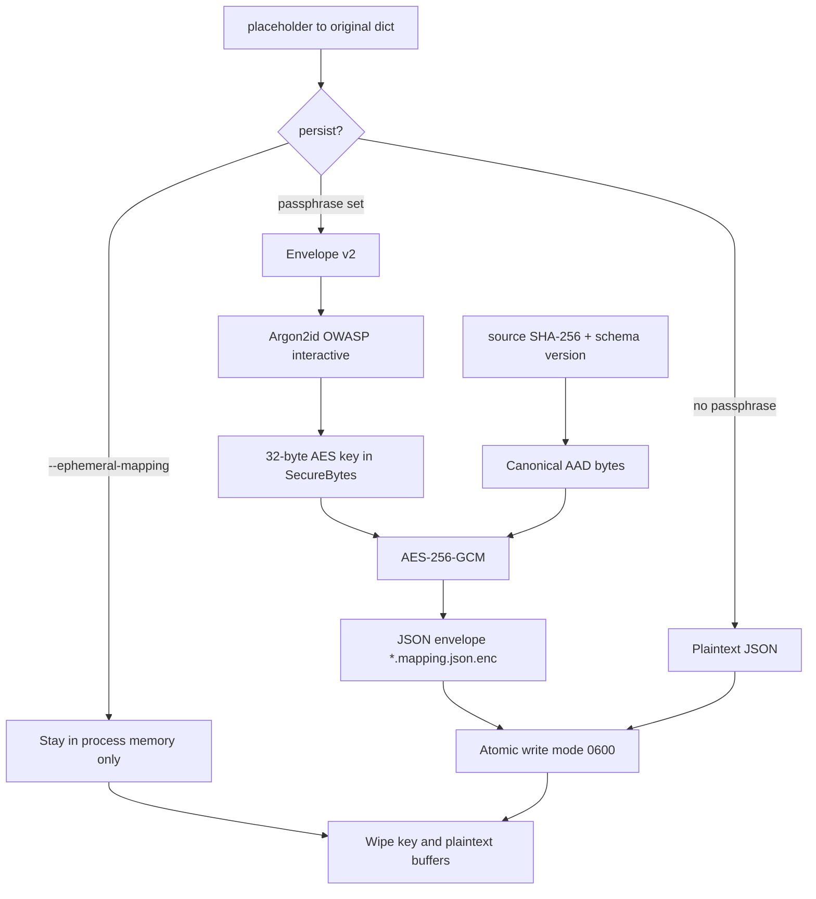

# Mapping encryption and file security

This page is the design note for how vocabulary / entity-mapping files are
protected. It covers the architecture, why each control exists, the
trade-offs, and what the tests actually prove.

The mapping file is the deanonymization key. Anyone who can read it can put
every original name back. The masked document without the map is still
personal data under GDPR *pseudonymization*, but it is not an instant
re-identification. A leaked `*.mapping.json` is.

`--operator TYPE=encrypt` is a different control: the *value* on the page is
an AES-256-GCM token (`ENC1_…`). Those originals are **not** written into the
mapping file. Reverse them with `--encrypt-secret` / `ANONYMIZER_ENCRYPT_SECRET`.
That is not format-preserving encryption (the token is longer than the source).

Default behaviour is unchanged: no passphrase still writes plaintext JSON.
New capabilities are optional flags and a harder envelope when a passphrase
*is* set.

Public APIs (`encrypt_mapping`, `decrypt_mapping`, `load_mapping_payload`,
`save_results`, `deanonymize_file`, CLI `run` / `deanonymize`) keep the same
positional signatures. Extra arguments are keyword-only.

---

## Architecture



### Modules

| Module | Role |
|---|---|
| `mapping_crypto.py` | Envelope format, Argon2id, AES-256-GCM, AAD, metadata validation, public encrypt/decrypt API |
| `secure_memory.py` | `SecureBytes`, `wipe_mutable`, `constant_time_equals`, `mlock`, `MADV_DONTDUMP` |
| `secure_io.py` | Atomic same-directory replace, `0600` files, `0700` mapping directory |
| `utils.save_results` / `deanonymize_file` | Hash the source file into AAD, honour ephemeral mode, wipe in-process maps after restore |
| CLI | `--ephemeral-mapping`, `--source-sha256` (deanonymize), existing `--mapping-passphrase` |

### Envelope v2 (what we write now)

```json
{
  "format": "pdf-anonymizer-mapping",
  "v": 2,
  "kdf": "argon2id",
  "cipher": "AES-256-GCM",
  "kdf_params": {"iterations": 2, "lanes": 1, "memory_cost": 19456},
  "salt": "<base64 16 bytes>",
  "nonce": "<base64 12 bytes>",
  "ciphertext": "<base64>",
  "aad": {
    "source_sha256": "<64 hex chars or empty>",
    "schema_version": 1
  }
}
```

AAD is **not** JSON. It is a canonical newline-delimited encoding so an
attacker cannot change the binding by adding spaces or reordering keys:

```
pdf-anonymizer-mapping
v=2
schema=1
sha256=<hex or empty>
```

Those bytes go into AES-GCM as associated data. They are authenticated, not
encrypted: you can read the claimed source hash without the passphrase, but
you cannot change it without breaking the tag.

### Envelope v1 (what we still read)

The first shipping lock (`feat/encrypted-mapping`, PR #44) used scrypt,
AES-256-GCM, and **no AAD**. Those files still decrypt. We do not write v1
any more.

### Decrypt pipeline (order matters)

1. Parse JSON.
2. **Validate every metadata field** (format, version, KDF, cipher, lengths,
   KDF parameter ranges, AAD shape). Reject before any KDF.
3. If the caller passed `--source-sha256` / `expected_source_sha256`,
   compare it to the envelope in constant time. Mismatch → same generic
   decrypt error as a bad passphrase (no oracle).
4. Derive the key (Argon2id for v2, scrypt for v1) into a wipeable buffer.
5. AES-GCM decrypt with the reconstructed AAD (or `None` for v1).
6. Parse JSON, wipe the plaintext buffer, return a `dict`.

---

## Why each control exists

### Authenticated encryption (AES-256-GCM)

Confidentiality alone is not enough. Without a tag, an attacker who can
flip bits in the ciphertext can mutilate recovered names in ways that are
hard to notice. GCM gives confidentiality + integrity in one primitive.
ChaCha20-Poly1305 would also work; we already shipped GCM in v1, so v2
stays on GCM.

### Argon2id instead of scrypt

v1 used `hashlib.scrypt` (`N=2^14`). That is a password KDF, but Argon2id
is the current OWASP recommendation: mixed data-dependent / data-independent
memory-hard hashing, better resistance to GPU and side-channel trade-offs
than scrypt or PBKDF2. Parameters are stored in the envelope so we can
raise them later without breaking old files.

Default parameters are OWASP's 2023 *interactive* set: 19 MiB,
2 iterations, 1 lane. That is a local-file passphrase, not a web login
under 10 ms.

### AAD: source SHA-256 + schema version

Two attacks the v1 envelope did not stop:

* **Transposition.** Copy the ciphertext (and salt/nonce) from document A's
  mapping into document B's envelope, or drop A's file next to B's masked
  text. Placeholders often start at `PERSON_1` in every file, so the stolen
  map can restore the wrong people or restore the right people onto the
  wrong document.
* **Replay of an older schema.** A future mapping JSON shape (`v` of the
  *data*, not the envelope) could be swapped onto a new reader.

Binding `source_sha256` and `schema_version` as GCM AAD means those fields
are part of the tag. Changing them, or moving ciphertext onto another
document's metadata, fails decrypt.

`save_results` hashes the original file and stores that digest. Deanonymize
can re-check it with `--source-sha256`. Cross-document `--mapping-in` does
**not** require the hash to match: that feature exists to reuse
placeholders across files.

### Validate metadata *before* crypto

A crafted envelope can set Argon2 `memory_cost` to a terabyte and turn
`deanonymize` into a denial-of-service. Unknown `kdf` / `cipher` / `v`
values are rejected with a precise error. Authentication failures (bad
passphrase, bad AAD, bad tag) share one generic message so we do not build
an oracle.

### Constant-time comparisons

GCM already compares tags in constant time. The remaining authentication
checks are string/int compares on `format`, `kdf`, `cipher`, the expected
source hash, and the schema version. CPython `==` can return on the first
differing byte. Those checks now go through `constant_time_equals` /
`constant_time_int_equals` (`hmac.compare_digest` on fixed-size SHA-256
or 8-byte integers, so unequal lengths do not raise).

### Atomic `0600` writes

`open(path, "w")` applies the process umask. With the common `0022` that
creates `0644`: every local account can read the mapping. Temporary files
written the same way can also linger after a crash, still world-readable.

`write_private_bytes`:

* `mkdir` the parent as `0700`
* `mkstemp` in the same directory (`O_EXCL`, already `0600`)
* `fchmod 0600` so umask cannot reopen the file
* write, `fsync`, `os.replace` (atomic on POSIX)
* unlink the temp file on any error
* `chmod 0600` the destination after replace (in case we replaced a looser
  file)

This applies to **plaintext and encrypted** mapping files, and to the temp
file used to create them.

### Zeroization, `mlock`, `MADV_DONTDUMP`

Python `str` / `bytes` are immutable. The runtime can intern them, copy
them, and leave them in heap until GC. We cannot promise a wipe of the
caller's passphrase string.

What we *can* own:

* passphrase UTF-8 bytes (`SecureBytes`)
* the 32-byte derived key (`SecureBytes`, filled with Argon2id
  `derive_into` so the KDF writes straight into our page)
* the JSON plaintext of the mapping (`bytearray`, wiped in a `finally`)
* the encoded buffer used by `write_private_json`

`SecureBytes` is a page-aligned anonymous `mmap`. On Linux we call
`mlock` (keep the page out of swap) and `madvise(..., MADV_DONTDUMP)`
(keep it out of core dumps). Both are best-effort: they fail on
`RLIMIT_MEMLOCK`, missing symbols, or non-Linux, and we still encrypt.

Wipe uses `ctypes.memset` so the store is harder to treat as dead.

After `deanonymize_file` finishes, the recovered `dict`s are `.clear()`'d.
That drops the references; it does not overwrite interned `str` objects.
That limit is documented rather than papered over.

### Ephemeral mode

`--ephemeral-mapping` (and `save_results(..., ephemeral_mapping=True)`)
never creates `data/mappings/`. The anonymized document is still written.
The caller already holds the dict in memory; the CLI keeps it for the rest
of a multi-file `run` so Ada stays `PERSON_1`, then the process exits.

There is no later `deanonymize` unless you saved the map yourself.

---

## Trade-offs

| Choice | We took | We did not take | Why |
|---|---|---|---|
| Cipher | AES-256-GCM | ChaCha20-Poly1305, age, nacl | v1 already shipped GCM; one primitive, two envelope versions |
| KDF | Argon2id (write), scrypt (read v1) | Break v1 files, or keep writing scrypt | Compatibility without leaving the weaker default in place |
| AAD source | SHA-256 of the *original* file | Hash of the anonymized file | The anonymized file is written at the same time as the map; the original is the stable identity |
| Cross-document maps | `--mapping-in` does not check AAD | Refuse to seed from another document | Item 10 (consistent placeholders) would break |
| Expected hash on deanonymize | Optional `--source-sha256` | Always require the original file | Users often only keep the masked file + the map |
| File mode | `0600` on mapping files only | Also lock anonymized / deanonymized output | The request is about mapping files; deanonymized output is a separate policy |
| Memory lock | Best-effort `mlock` + `MADV_DONTDUMP` | Fail closed if `mlock` fails | Unprivileged `RLIMIT_MEMLOCK` is common; failing closed would break `run` |
| Zeroization | Wipe buffers we own | Claim we wipe Python `str` | That claim would be false |
| Ephemeral | Skip the file entirely | Encrypt in RAM and discard | There is no consumer for an in-RAM envelope the CLI never prints |
| Passphrase UX | Flag + env var | OS keychain, hardware token | Out of scope; same CLI as v1 |
| Default on disk | Still plaintext | Encrypt-by-default | Working rule: default behaviour stays the same unless a flag is passed |

A locked map without the passphrase cannot be recovered. That is
intentional. Back up the passphrase outside the repository.

---

## Threat model (short)

**In scope**

* Another local account reading `data/mappings/` (umask / shared host).
* A leaked `*.mapping.json.enc` without the passphrase.
* Moving ciphertext between envelopes / documents.
* A crafted envelope that tries to DoS the KDF.
* Secrets landing in swap or a core dump *when the OS allows us to prevent it*.

**Out of scope**

* An attacker who already has the process memory and the passphrase.
* Cold-boot / DMA against unlocked RAM.
* Multi-user *intended* sharing of a mapping (use a secrets manager).
* Homomorphic encryption or computing on encrypted names.

---

## Tests

Tests live in `tests/test_mapping_crypto.py` and `tests/test_secure_memory.py`.
They are split into a **legacy / issue** half and a **remediated** half so
the old holes stay visible.

### `TestEncryptDecrypt` / `TestSaveAndDeanonymizeEncrypted`

Public-API regression. Round-trip, wrong passphrase, empty passphrase,
plaintext load, env-vs-flag resolution, `save_results` still writes
`*.mapping.json.enc`, `deanonymize` still restores. New envelopes must
be `v=2` / `argon2id`.

### `TestLegacyMissingAad` — issue + fix for transposition

| Test | What it shows |
|---|---|
| `test_v1_envelope_has_no_aad_and_decrypts_for_any_document` | The old hole: a scrypt envelope has no `aad` and decrypts with no source check |
| `test_v2_binds_source_hash_as_aad` | Wrong `source_sha256` is rejected |
| `test_aad_field_tamper_is_detected` | Editing `aad.source_sha256` in the JSON breaks the GCM tag |
| `test_schema_version_tamper_is_detected` | Same for `schema_version` |
| `test_ciphertext_moved_onto_other_document_aad_fails` | Copy A's ciphertext onto B's envelope → decrypt fails |
| `test_save_results_binds_source_file_hash` | `save_results` hashes the source file; `deanonymize_file(..., expected_source_sha256=...)` enforces it |

Legacy v1 envelopes are built by `legacy_v1_encrypt` in the test file (a
faithful copy of the original `encrypt_mapping`), not by production code.

### `TestEnvelopeValidationBeforeCrypto`

| Test | What it shows |
|---|---|
| `test_unknown_kdf_does_not_run_argon2` | `kdf: "pbkdf2"` raises before `Argon2id` is constructed |
| `test_huge_memory_cost_rejected_before_kdf` | `memory_cost = 10**12` is rejected; the KDF is never started |
| `test_wrong_nonce_length_rejected` | Garbage nonce fails in validation, not in AES |
| `test_missing_aad_block_rejected` / `test_unsupported_version_rejected` | Strict shape / version checks |
| `test_legacy_v1_still_decrypts` | Compatibility: old files still open |

The two "does not run Argon2" tests replace `Argon2id` with a constructor
that raises `AssertionError` if it is called. A failure would mean we
started crypto on a rejected envelope.

### `TestMappingFilePermissions` — issue + fix for umask

| Test | What it shows |
|---|---|
| `test_legacy_open_write_is_group_or_world_readable` | With umask `0022`, the old `open(..., "w")` path is group/other-readable (`0644`) |
| `test_write_private_json_is_0600_even_with_permissive_umask` | Even umask `0000` cannot produce a world-readable private write |
| `test_save_results_plaintext_and_encrypted_are_0600` | Both mapping kinds get `0600` |
| `test_atomic_write_leaves_no_temp_file` | No `*.tmp` leftover after success |
| `test_failed_write_unlinks_temp` | A mid-write `OSError` leaves neither dest nor temp |

### `TestMemoryWiping`

| Test | What it shows |
|---|---|
| `test_encrypt_wipes_secure_buffers` / `test_decrypt_wipes_secure_buffers` | `SecureBytes.wipe` runs at least twice (passphrase + key) on both paths |
| `test_plaintext_bytearray_is_zeros_after_encrypt` | The mapping JSON buffer that contained `Ada Lovelace` is passed to `wipe_mutable` |

`tests/test_secure_memory.py` is the finer unit layer:

* `wipe_mutable` overwrites a `bytearray` of PII with zeros
* `SecureBytes` context manager wipes; `view()` after wipe raises
* `mlock` and `madvise(..., MADV_DONTDUMP=16)` are actually invoked (fake libc)
* `constant_time_equals` handles equal strings, unequal strings, and unequal
  lengths without raising (unlike raw `hmac.compare_digest` on some Python
  versions)

The `==` test in `TestConstantTimeEquals` is the "before" half: it records
that the old metadata check would have used Python equality, which is not
an authentication primitive.

### `TestEphemeralMapping`

`save_results(..., ephemeral_mapping=True)` returns `""` for the mapping
path, writes the anonymized file, and creates no `data/mappings/` entry —
with or without a passphrase.

### What we do not claim to test

* A statistical timing test that `==` is faster than `compare_digest` on
  this CPU. That is noisy in CI. We test that the constant-time helper is
  the one production code calls, and that it does not raise on length
  mismatch.
* That `mlock` always succeeds. CI often has a small `RLIMIT_MEMLOCK`. We
  test that the syscalls are issued and that failure is non-fatal.
* That CPython interned `str` objects are gone after `dict.clear()`. They
  are not, and the tests do not pretend otherwise.

---

## CLI and SDK additions (non-breaking)

```bash
# Lock (v2 envelope, AAD bound to the source file hash)
pdf-anonymizer run report.pdf --mapping-passphrase 'a long secret'

# Never write data/mappings/
pdf-anonymizer run report.pdf --ephemeral-mapping

# Refuse a map that was locked for a different source file
pdf-anonymizer deanonymize \
  data/anonymized/report.anonymized.md \
  data/mappings/report.mapping.json.enc \
  --mapping-passphrase 'a long secret' \
  --source-sha256 '<sha256 of report.pdf>'
```

```python
from pdf_anonymizer_core.mapping_crypto import encrypt_mapping, decrypt_mapping
from pdf_anonymizer_core.utils import save_results

envelope = encrypt_mapping(
    {"PERSON_1": "Ada Lovelace"},
    "a long secret",
    source_sha256="ab" * 32,
)
save_results(text, mapping, path, ephemeral_mapping=True)
```

`encrypt_mapping(mapping, passphrase)` with no keywords still works. The
AAD then binds an empty source hash so the field cannot be filled in later
without breaking the tag.

---

## See also

- [Recipes](recipes.md) — day-to-day lock / unlock examples
- [Architecture](architecture.md) — where this sits in the pipeline
- [CLI reference](cli-usage.md)
- [Troubleshooting](troubleshooting.md) — "encrypted mapping will not open"
